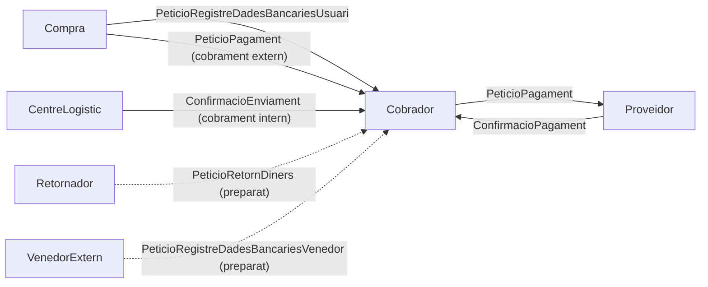

# Implementacio Agent Cobrador i Agent Proveidor de Pagament

## Objectiu
Implementar els dos agents de gestio de pagaments seguint el disseny detallat 4.3 de [Entrega3.pdf](Entrega-3/Entrega3.pdf), respectant FIPA-ACL/RDF i el patro de la resta d'agents (`/comm` amb `build_message`, contingut RDF amb namespace `AZON`, persistencia via `services/*`, descobriment via Directory/DSO).

- **Agent Proveidor de Pagament** = actor extern (el Banc). Simulador sense estat que processa `PeticioPagament` i retorna `ConfirmacioPagament`.
- **Agent Cobrador** = agent intern amb 3 capacitats i 5 plans, despatxats al `/comm` segons el `RDF.type` del contingut.

## Flux general

Les fletxes puntejades (Retornador, Venedor Extern) es deixen preparades al protocol pero NO es creen aquests agents (segons abast acordat).

## Capacitats del Cobrador (despatx per tipus de contingut a `/comm`)
- **Guardar dades bancaries**
  - `PeticioRegistreDadesBancariesUsuari` (de Compra) -> desa a `data/dades_bancaries_usuari.ttl` -> respon `ConfirmacioRegistreDadesBancaries`.
  - `PeticioRegistreDadesBancariesVenedor` (de Venedor Extern, preparat) -> desa a `data/dades_bancaries_venedors_externs.ttl` -> confirma.
- **Cobrar compra**
  - Intern: rep `ConfirmacioEnviament` del Centre Logistic -> calcula l'import dels productes via `services.catalog_service.get_products_by_ids` (llegint `productes.ttl`) -> envia `PeticioPagament` al Proveidor -> persisteix el pagament i la factura -> retorna `ConfirmacioPagament` al Centre Logistic.
  - Extern: rep `PeticioPagament` de Compra -> fa el pagament al Venedor Extern via Proveidor -> confirma a Compra.
- **Gestionar Devolucions**
  - `PeticioRetornDiners` (de Retornador, preparat) -> llegeix dades bancaries de l'usuari (o del venedor si es producte extern) -> reemborsa via Proveidor -> registra a `data/devolucions.ttl` -> confirma.

La factura es modela DINS de `ConfirmacioPagament` (import, IdComanda, data, `SobreProducte`), sense classe nova. Com que no hi ha agent Usuari, "enviar la factura a l'usuari" es materialitza persistint-la i registrant-la al log (limitacio documentada).

## Fitxers nous
- `AgentZon/protocols/pagament.py`: builders/parsers per `PeticioRegistreDadesBancariesUsuari`/`Venedor`, `ConfirmacioRegistreDadesBancaries`, `PeticioPagament`, `ConfirmacioPagament`, trigger de cobrament intern (`ConfirmacioEnviament` cap al Cobrador) i `PeticioRetornDiners` (preparat). Mateix estil que [protocols/compra.py](AgentZon/protocols/compra.py) i [protocols/centre_logistic.py](AgentZon/protocols/centre_logistic.py).
- `AgentZon/services/payment_service.py`: `save_user_bank_data`, `save_seller_bank_data`, `read_user_bank_data`, `read_seller_bank_data`, `record_payment` (nou `data/pagaments.ttl`), `record_refund` (`data/devolucions.ttl`). Estil de [services/order_service.py](AgentZon/services/order_service.py) sobre [services/rdf_store.py](AgentZon/services/rdf_store.py).
- `AgentZon/agents/agent_cobrador.py`: Flask `/comm`,`/iface`,`/Stop`; registre al Directory com a `DSO.CobradorAgent`; resol el Proveidor via Directory; argument `--data-dir`. Patro de [agents/agent_opinador.py](AgentZon/agents/agent_opinador.py)/[agents/agent_compra.py](AgentZon/agents/agent_compra.py).
- `AgentZon/agents/agent_proveidor_de_pagament.py`: Flask `/comm`,`/iface`,`/Stop`; registre com a `DSO.ProveidorPagamentAgent`; simulador sense estat que respon `ConfirmacioPagament`. Patro de [agents/agent_transportista.py](AgentZon/agents/agent_transportista.py).

## Fitxers a modificar
- [AgentUtil/DSO.py](AgentZon/AgentUtil/DSO.py): afegir termes `CobradorAgent` i `ProveidorPagamentAgent` a la `ClosedNamespace`.
- [config.py](AgentZon/config.py): afegir ports `cobrador: 9005` i `proveidor_pagament: 9006` a `DEFAULT_PORTS`.
- [ontologia/AgentZonOntology.rdf](AgentZon/ontologia/AgentZonOntology.rdf): afegir classes `PeticioRegistreDadesBancariesUsuari`, `PeticioRegistreDadesBancariesVenedor`, `ConfirmacioRegistreDadesBancaries`, `PeticioRetornDiners` (+ `ConfirmacioRetornDiners` o reus de `ConfirmacioPagament`); afegir datatype property `DadesBancariesUsuari` i, si cal, `DataPagament`. Reaprofitar les ja existents (`Banc`, `Pagament`, `PeticioPagament`, `ConfirmacioPagament`, `ImportPagament`, `MetodePagament`, `Estat`, `IdPagament`, `IdBanc`, `DadesBancariesVenedorExtern`, `IdComanda`, `IdUsuari`, `MotiuDevolucio`, `IdDevolucio`).
- [agents/agent_centre_logistic.py](AgentZon/agents/agent_centre_logistic.py): implementar `pla_producte_sha_enviat` perque, despres de seleccionar transportista, resolgui el Cobrador via Directory i li enviï el trigger de cobrament intern (`ConfirmacioEnviament` amb `order_id`, `user_id`, ids de productes, cost de transport, data); rebre la `ConfirmacioPagament`. Afegir `--data-dir` ja existeix.
- [agents/agent_compra.py](AgentZon/agents/agent_compra.py): (1) durant el processament de compra, registrar les dades bancaries de l'usuari al Cobrador (`PeticioRegistreDadesBancariesUsuari`) i rebre confirmacio; (2) a `pla_enviament_extern`, enviar `PeticioPagament` al Cobrador per al cobrament extern. Resolucio del Cobrador via `resolve_agent(DSO.CobradorAgent)`.
- [README.md](AgentZon/README.md): afegir les comandes d'arrencada del Proveidor (port 9006) i del Cobrador (port 9005) i l'ordre d'arrencada recomanada.

## Notes de disseny / limitacions a documentar
- Tota la comunicacio es fa amb missatges FIPA-ACL (`build_message`) i contingut RDF de l'ontologia: cap crida API "nua".
- El cobrament intern al disseny s'activa per temps ("lot amb data = avui"); aqui es dispara just despres de l'eleccio de transportista per fer-lo demostrable de punta a punta (simplificacio).
- No hi ha agent Usuari: la factura i la confirmacio cap a l'usuari es persisteixen/loguegen.
- Els fluxos de Retornador i Venedor Extern queden definits a l'ontologia i al protocol pero sense agents emissors (fora d'abast).