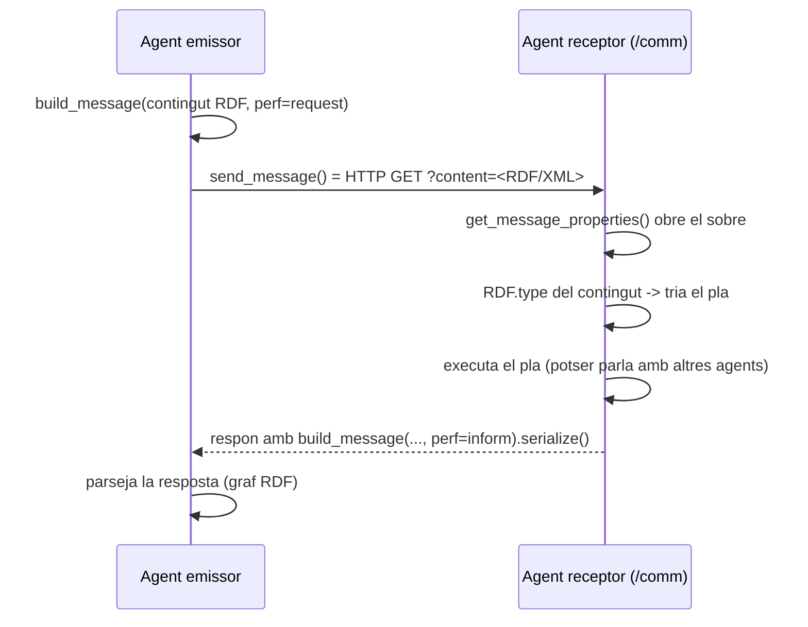
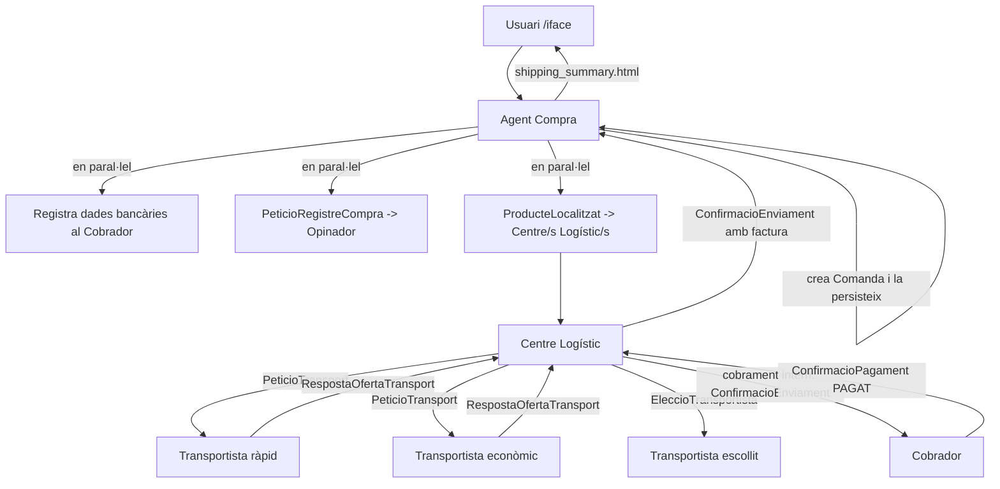

# Guia per a nous integrants — AgentZon

> Aquesta guia està pensada per a algú que **s'acaba d'incorporar al projecte i no en sap res**.
> Explica què és AgentZon, en quin idioma està escrit cada cosa, **com es comuniquen els agents**
> (la part més important), què fa cada fitxer i com posar-ho tot en marxa. Tot està basat en
> els patrons dels exemples del professor (carpeta `REFERENCE/` a l'arrel del repositori).

---

## Índex

1. [Què és AgentZon en 2 minuts](#1-què-és-agentzon-en-2-minuts)
2. [En quin idioma està escrit cada cosa](#2-en-quin-idioma-està-escrit-cada-cosa)
3. [Les 4 tecnologies que has d'entendre](#3-les-4-tecnologies-que-has-dentendre)
4. [Com es comuniquen els agents (el cor del sistema)](#4-com-es-comuniquen-els-agents-el-cor-del-sistema)
5. [El servei de directori (com es troben entre ells)](#5-el-servei-de-directori-com-es-troben-entre-ells)
6. [Anatomia d'un agent](#6-anatomia-dun-agent)
7. [L'ontologia: el vocabulari compartit](#7-lontologia-el-vocabulari-compartit)
8. [Recorregut per tots els fitxers](#8-recorregut-per-tots-els-fitxers)
9. [Els fluxos complets, pas a pas](#9-els-fluxos-complets-pas-a-pas)
10. [Com posar-ho en marxa](#10-com-posar-ho-en-marxa)
11. [Com afegir un agent o un missatge nou](#11-com-afegir-un-agent-o-un-missatge-nou)
12. [Glossari](#12-glossari)

---

## 1. Què és AgentZon en 2 minuts

AgentZon és un prototip d'una **botiga distribuïda** (estil Amazon) per a la pràctica d'ECSDI.
No és una aplicació monolítica: és un **sistema multiagent**. Cada "agent" és un **procés
independent** (un servidor web Flask) que s'executa en el seu propi port i parla amb els altres
**enviant-se missatges per la xarxa**.

Els agents que tenim ara mateix:

| Agent | Port | Rol (què fa) |
|-------|------|--------------|
| **Directory** | 9000 | Pàgines grogues: tots els altres s'hi registren i s'hi busquen entre ells |
| **Cercador** | 9001 | Cerca productes al catàleg, resol snapshots per ID i deriva el registre de cerques cap a l'Opinador |
| **Compra** | 9002 | Orquestra una comanda de principi a fi (l'agent "director d'orquestra") |
| **Centre Logístic** | 9003 / 9007 / 9008 | Agrupa productes en lots, negocia amb transportistes, demana el cobrament |
| **Opinador** | 9004 | És el propietari de l'historial de cerques, compres i feedback; també genera suggeriments i avalua devolucions |
| **Cobrador** | 9005 | És el propietari de les dades bancàries i dels pagaments; calcula cobraments interns des del missatge ACL, sense llegir el catàleg |
| **Transportista** | 9010 (ràpid) / 9011 (econòmic) | Agents **externs** que ofereixen preu i data d'entrega |
| **Venedor Extern** | 9012 | Gateway intern que dona d'alta productes externs delegant el catàleg a Cercador, les metadades logístiques a Compra i el perfil bancari a Cobrador |

Des del refactor d'ownership, cada base `.ttl` té **un únic agent propietari**:
- `Cercador` és l'únic propietari de `productes.ttl`.
- `Compra` és l'únic propietari de `dades_enviament_usuari.ttl`, `responsable_enviament_productes.ttl`, `ubicacions_productes.ttl` i `seguiment_enviaments.ttl`.
- `Opinador` és l'únic propietari de `historial_cerques.ttl`, `historial_compres.ttl` i `feedback.ttl`.
- `Retornador` és l'únic propietari de `devolucions.ttl`.
- `Cobrador` és l'únic propietari de `dades_bancaries_usuari.ttl`, `dades_bancaries_venedors_externs.ttl` i `pagaments.ttl`.

Quan un altre agent necessita aquestes dades, no llegeix el fitxer directament: envia un missatge
ACL a l'agent propietari (`PeticioConsultaProductes`, `PeticioRegistreCerca`,
`PeticioConsultaCompresUsuari`, `PeticioConsultaDadesBancariesVenedor`,
`PeticioRegistreProducteExternCompra`, etc.).

**Idea clau:** la gràcia de la pràctica és que això funcioni de manera **realment distribuïda**
(processos separats que es parlen amb missatges), i que els missatges utilitzin els **conceptes
de l'ontologia**, no crides API "nues". Si féssim una simple API REST sense ontologia, o ho
féssim tot dins d'un sol procés seqüencial, **la nota baixaria**.

---

## 2. En quin idioma està escrit cada cosa

Com que l'equip ha fet servir molta IA, és normal que et preguntis "en quin idioma està això".
La convenció real del projecte és aquesta i és bastant consistent:

- **Català** → tot el que és del nostre domini de negoci:
  - Els **conceptes de l'ontologia** (`Producte`, `Comanda`, `Lot`, `PeticioCompra`, `Pagament`…).
  - Els **noms dels plans** dels agents (`pla_de_cerca`, `pla_assignar_producte_a_lot`,
    `pla_informar_usuari_sobre_l_enviament`…). Aquests noms surten directament dels diagrames
    Prometheus de l'Entrega 2.
  - Els **comentaris** i els **logs** (`logger.info("Rebuda peticio ACL de cerca")`).
- **Anglès** → els **identificadors tècnics** dins del codi Python (noms de variables i de claus
  de diccionari: `product_id`, `order_id`, `shipping_data`, `delivery_date`…). Això és perquè
  les estructures internes són "fontaneria" i no formen part del model conceptual.
- **Castellà/anglès original del professor** → la carpeta `AgentUtil/`. Són utilitats que **venen
  dels exemples del professor** (mira `REFERENCE/AgentUtil/`). Per això hi veuràs
  `@author: javier` i comentaris en castellà. **No les reescriguis**: són la base comuna i
  estan pensades per ser reutilitzades tal qual.

> Regla pràctica: si toques **lògica de negoci o ontologia**, escriu en català seguint els noms
> de l'Entrega. Si toques **infraestructura d'`AgentUtil`**, respecta l'estil original del professor.

---

## 3. Les 4 tecnologies que has d'entendre

Són exactament les mateixes que fa servir el professor als seus exemples.

1. **Flask** — micro-framework web. Cada agent és una `app` de Flask amb uns quants *endpoints*
   (`/comm`, `/iface`, `/Stop`, i el Directory `/Register`). Quan un agent "rep un missatge",
   en realitat **rep una petició HTTP GET**.
2. **`requests`** — la llibreria amb què un agent **envia** una petició HTTP a un altre.
3. **RDF / OWL + `rdflib`** — el contingut dels missatges **no és JSON**: és un **graf RDF**
   (triples subjecte–predicat–objecte) serialitzat en XML. `rdflib` és la llibreria Python per
   construir, serialitzar i consultar aquests grafs. L'ontologia (vocabulari) està en OWL.
4. **FIPA-ACL** — l'**estàndard de missatges entre agents**. Cada missatge va embolicat en un
   "sobre" amb un *performative* (`request`, `inform`, `confirm`, `failure`,
   `not-understood`…), un emissor, un receptor i un contingut. És el que fa que això sigui un
   "sistema d'agents" i no una API qualsevol.

Una consulta puntual del catàleg es fa amb **SPARQL** (el "SQL del RDF"); ho veuràs a
`services/catalog_service.py`.

---

## 4. Com es comuniquen els agents (el cor del sistema)

Aquesta és la part que has d'entendre sí o sí. Tota la comunicació passa per **3 funcions**
que viuen a [`AgentUtil/ACLMessages.py`](AgentUtil/ACLMessages.py):

- `build_message(...)` → posa el contingut RDF dins d'un **sobre FIPA-ACL**.
- `send_message(...)` → **envia** el sobre per HTTP i retorna la **resposta** com a graf RDF.
- `get_message_properties(...)` → **obre** un sobre rebut i n'extreu les propietats
  (performative, sender, receiver, content…).

### 4.1 El "sobre" FIPA-ACL

Un missatge és un graf RDF que conté un node de tipus `acl:FipaAclMessage`. Així el construeix
`build_message`:

```python
def build_message(gmess, perf, sender=None, receiver=None, content=None, ontology=None, msgcnt=0):
    mssid = f"message-{hash(sender)}-{msgcnt:04d}"
    ms = URIRef(mssid)
    gmess.add((ms, RDF.type, ACL.FipaAclMessage))
    gmess.add((ms, ACL.performative, perf))      # request / inform / confirm / failure...
    gmess.add((ms, ACL.sender, sender))           # URI de qui envia
    gmess.add((ms, ACL.receiver, receiver))       # URI de qui rep
    gmess.add((ms, ACL.content, content))         # URI que "apunta" al contingut RDF
    gmess.add((ms, ACL.ontology, ontology))       # quina ontologia parlem
    return gmess
```

Fixa't que **`gmess` ja conté el contingut** (els triples del producte, la comanda, etc.) i
`build_message` només **hi afegeix la capçalera del sobre**. El paràmetre `content` és la **URI**
que enllaça el sobre amb el node de contingut dins del mateix graf.

### 4.2 Enviar i rebre

`send_message` serialitza el graf a XML i el passa com a paràmetre `content` d'una **petició GET**:

```python
def send_message(gmess, address, timeout=10):
    payload = gmess.serialize(format="xml")
    response = requests.get(address, params={"content": payload}, timeout=timeout)
    response.raise_for_status()
    graph = Graph()
    graph.parse(data=response.text, format="xml")   # la resposta també és un graf RDF
    return graph
```

A l'altra banda, l'agent receptor té un *endpoint* `/comm` que fa **sempre el mateix patró**:

```python
@app.route("/comm")
def comm():
    # 1) Reconstruir el graf del missatge rebut
    message_graph = Graph()
    message_graph.parse(data=request.args["content"], format="xml")

    # 2) Obrir el sobre
    properties = get_message_properties(message_graph)

    # 3) Validar que sigui un FIPA-ACL request
    if not properties or properties.get("performative") != ACL.request:
        return build_message(Graph(), ACL["not-understood"], sender=AGENT.uri,
                             msgcnt=next_counter()).serialize(format="xml")

    # 4) Mirar QUIN tipus d'acció és (segons el RDF.type del contingut)
    content = properties["content"]
    action = message_graph.value(content, RDF.type)   # p.ex. AZON.PeticioCerca

    # 5) Executar el pla corresponent i respondre amb un altre missatge ACL
    ...
    return response.serialize(format="xml")
```

Aquest patró és **idèntic** al de l'exemple `REFERENCE/Examples/AgentExamples/SimpleInfoAgent.py`
del professor. L'hem repetit a tots els agents.

### 4.3 Els *performatives* que fem servir

| Performative | Quan el fem servir |
|--------------|--------------------|
| `request`    | "Fes aquesta acció" (cerca, compra, transport, pagament, registre…) |
| `inform`     | "Aquí tens el resultat / la informació que demanaves" |
| `confirm`    | "Confirmat" (el Directory el fa servir quan s'ha registrat un agent) |
| `failure`    | "He intentat fer-ho però ha fallat" (p.ex. cap producte a la comanda) |
| `not-understood` | "El missatge no és vàlid o l'acció no la sé fer" |

**Convenció important:** una *acció* sempre s'envia amb `request` i el seu contingut és un node
RDF de tipus "Peticio..." (`PeticioCerca`, `PeticioCompra`, `PeticioTransport`…). La *resposta*
torna amb `inform` i el contingut és un node "Resultat..."/"Confirmacio..." o "Resposta...".

### 4.4 Exemple complet: el Cercador demana on és l'agent de Compra

Aquest fragment real ([`agents/agent_cercador.py`](agents/agent_cercador.py)) ensenya el cicle
sencer **construir → enviar → rebre → parsejar**:

```python
def resolve_compra_agent():
    message = build_search_message(AGENT, DSO.CompraAgent, DIRECTORY_AGENT, msgcnt=next_counter())
    response = MESSAGE_SENDER(message, DIRECTORY_AGENT.address)   # GET cap al Directory
    return parse_directory_response(response)                    # treu l'adreça del graf
```

### 4.5 Diagrama mental



---

## 5. El servei de directori (com es troben entre ells)

Cap agent té "cablejada" l'adreça dels altres (excepte la del Directory, que és l'únic punt fix).
Tot passa pel **Directory Service**, exactament com a l'exemple
`REFERENCE/Examples/AgentExamples/SimpleDirectoryService.py`.

Fem servir una ontologia auxiliar, la **DSO** (Directory Service Ontology), definida a
[`AgentUtil/DSO.py`](AgentUtil/DSO.py). Conté els termes `Register`, `Search`, `AgentType`,
`Uri`, `Address`… i el **tipus de cada agent nostre** (`CercadorAgent`, `CompraAgent`,
`CentreLogisticAgent`, `CobradorAgent`, `OpinadorAgent`).

### 5.1 Registre (en arrencar)

Quan un agent arrenca, s'envia a si mateix al Directory amb un `request` + acció `DSO.Register`:

```python
# protocols/directory.py
def build_register_message(agent, agent_type, directory_agent, msgcnt=0, metadata=None):
    graph = Graph()
    content = AGN[f"{agent.name}-register"]
    graph.add((content, RDF.type, DSO.Register))
    graph.add((content, DSO.Uri, agent.uri))
    graph.add((content, FOAF.name, Literal(agent.name)))
    graph.add((content, DSO.Address, Literal(agent.address)))
    graph.add((content, DSO.AgentType, agent_type))
    # metadata extra: p.ex. un Centre Logístic afegeix el seu IdCentreLogistic i Ciutat
    ...
    return build_message(graph, perf=ACL.request, sender=agent.uri,
                         receiver=directory_agent.uri, content=content, msgcnt=msgcnt)
```

El Directory guarda tot això en un graf RDF a memòria
([`agents/agent_directory.py`](agents/agent_directory.py), `process_register`).

### 5.2 Cerca (en temps d'execució)

Quan un agent necessita un altre, envia un `request` + acció `DSO.Search` indicant el
**tipus** d'agent que busca. El Directory retorna un `inform` amb les dades de tots els agents
d'aquell tipus.

> **Detall important per a la pràctica:** el Directory pot retornar **diversos** agents del
> mateix tipus. Això és el que ens permet tenir **3 Centres Logístics** (BCN, GI, TGN) registrats
> alhora i triar el més proper a cada producte. Mira `parse_directory_responses` (en plural) a
> [`protocols/directory.py`](protocols/directory.py).

---

## 6. Anatomia d'un agent

Tots els agents segueixen la **mateixa plantilla** (de nou, la del professor). Si n'entens un,
els entens tots. Les seccions són sempre aquestes:

```python
# 1) Imports: AgentUtil (ACL, ACLMessages, DSO, Flask...), config, protocols, services
# 2) app = Flask(__name__)  +  logger
# 3) Variables globals de l'agent (AGENT, DIRECTORY_AGENT, rutes de dades, COUNTER...)

# 4) configure_runtime(settings): omple les globals (separat de main per poder fer TESTS)
def configure_runtime(settings, message_sender=send_message): ...

# 5) next_counter(): numera els missatges

# 6) PLANS: la lògica de negoci. Un mètode "pla_..." per capacitat (noms de l'Entrega)
def pla_de_cerca(criteria): ...

# 7) @app.route("/comm"): rep ACL, tria el pla segons RDF.type, respon ACL
# 8) @app.route("/iface"): interfície web humana (només alguns agents)
# 9) @app.route("/Stop"): atura el procés

# 10) main(): llegeix els arguments (argparse) i crida serve_agent(...)
#     -> serve_agent llança el comportament concurrent (registre al Directory)
#        en un multiprocessing.Process i després arrenca el servidor Flask
```

Tres detalls de disseny que has d'entendre:

- **`configure_runtime` separat de `main`** existeix perquè els **tests** puguin muntar l'agent
  amb dades de prova i un `message_sender` fals (sense xarxa real). És el truc que fa que el
  projecte sigui testejable.
- **`serve_agent` (a `config.py`) segueix el patró dels agents d'exemple del professor**
  (Cap. 2 i 6 del laboratori): un agent és un servidor Flask **més un comportament concurrent**.
  Es llança un `multiprocessing.Process` (l'equivalent del `agentbehavior1` dels exemples) que fa
  el **registre al Directory** i queda a l'espera d'una cua (`Queue`); en paral·lel arrenca
  `app.run(...)`. Quan s'atura el servidor, el procés principal diposita un `0` a la cua per
  acabar el comportament netament (`Process` + `Queue` + `join`, tal com a `SimpleInfoAgent`).
- **Els "plans"** (`pla_...`) corresponen un a un amb les **capacitats dels diagrames Prometheus**
  de l'Entrega 2. **No els reanomenis** a noms genèrics: el professor compara el codi amb els
  diagrames.

---

## 7. L'ontologia: el vocabulari compartit

El fitxer [`ontologia/AgentZonOntology.rdf`](ontologia/AgentZonOntology.rdf) (OWL) defineix
**tots els conceptes** que els agents s'intercanvien. Hi ha documentació HTML generada a
`ontologia/docs/ontology.html` i un graf visual a `ontologia/docs/ontology_graph.png`.

Estructura conceptual:

- **`Comunicacio`** (arrel) → **`Accio`** (peticions) i **`Resposta`** (respostes).
  - Tota "Peticio..." és una `Accio`; tota "Confirmacio.../Resultat.../Resposta..." és una `Resposta`.
- **`Actor`** → `Usuari`, `Transportista`, `VenedorExtern`, `Banc`.
- Entitats de domini: `Producte`, `Comanda`, `Lot`, `Pagament`, `Devolucio`, `Feedback`,
  `CentreLogistic`, `Recomanacio`.
- **Propietats d'objecte** (enllacen nodes): `TeProducte`, `SobreComanda`, `SobreLot`,
  `SobreProducte`, `UbicatACentre`, `AssignatATransportista`, `MostraProducte`…
- **Propietats de dada** (valors): `IdProducte`, `Nom`, `Preu`, `Pes`, `Ciutat`, `Prioritat`,
  `ImportPagament`, `MetodePagament`, `Estat`, `SentitPagament`…

### 7.1 Com es fa servir l'ontologia (i per què importa per la nota)

Cada missatge construeix el seu contingut amb el **namespace `AZON`**
([`AgentUtil/OntoNamespaces.py`](AgentUtil/OntoNamespaces.py)):

```python
from AgentUtil.OntoNamespaces import AZON
graph.add((content, RDF.type, AZON.PeticioCerca))         # l'acció és un concepte de l'ontologia
graph.add((content, AZON.TextConsulta, Literal(text)))    # els camps també
```

Això és exactament el que demana l'enunciat i el que **evita la penalització** de "implementar
els agents com una simple API REST sense fer servir l'ontologia": les nostres accions i conceptes
**són** classes i propietats de l'ontologia, tant a la comunicació com a la persistència.

### 7.2 El sentit del pagament (`SentitPagament`)

El professor va comentar que **els pagaments van en dues direccions** i que no quedava clar si
les distingíem. Ara sí: la propietat **`azon:SentitPagament`** marca cada `Pagament`,
`PeticioPagament` i `ConfirmacioPagament` amb un de dos valors (constants a
[`protocols/pagament.py`](protocols/pagament.py)):

- **`COBRAMENT`** → diners **entrants**: la botiga **cobra** l'usuari (cobrament intern, disparat
  pel Centre Logístic quan el producte s'ha enviat).
- **`PAGAMENT`** → diners **sortints**: la botiga **paga** un venedor extern, o **retorna** diners
  a l'usuari (devolució).

Així, encara que tots dos passin pel mateix Cobrador, queden **distingits a l'ontologia i als fitxers
`pagaments.ttl`/`devolucions.ttl`**. El Cobrador **no delega** en cap banc extern: respon sempre amb
confirmació (`PAGAT` o `RETORNAT`) i registra el moviment als `.ttl` corresponents.

---

## 8. Recorregut per tots els fitxers

### `AgentUtil/` — infraestructura comuna (ve del professor, no la toquis)

| Fitxer | Què conté |
|--------|-----------|
| `ACL.py` | `ClosedNamespace` amb tots els termes FIPA-ACL (`request`, `inform`, `performative`…). |
| `ACLMessages.py` | `build_message`, `send_message`, `get_message_properties` + helpers de registre/cerca al directori. **El moll de l'os de la comunicació.** |
| `Agent.py` | Classe `Agent` minúscula: només guarda `name`, `uri`, `address`, `stop`. |
| `DSO.py` | `ClosedNamespace` de la Directory Service Ontology (termes de registre i tipus d'agents). |
| `OntoNamespaces.py` | Defineix `AZON` (la nostra ontologia), `AGN` (namespace d'agents) i `bind_namespaces()`. |
| `FlaskServer.py` | `shutdown_server()` per a l'endpoint `/Stop`. |
| `Logging.py`, `Util.py`, `SPARQLPoints.py` | Logging, `gethostname()`, constants de SPARQL. |

### `agents/` — un fitxer per agent (la capa de procés/Flask)

| Fitxer | Endpoints | Plans / capacitats principals |
|--------|-----------|-------------------------------|
| `agent_directory.py` | `/Register`, `/Info`, `/Stop` | `process_register`, `process_search` |
| `agent_cercador.py` | `/comm`, `/iface`, `/Stop` | `pla_de_cerca`, `pla_de_presentacio`, `pla_afegir_info_producte_extern_a_la_bd`, `pla_consulta_productes_acl`, `pla_registrar_cerca_a_opinador` |
| `agent_compra.py` | `/comm`, `/iface`, `/Stop` | `pla_demanar_informacio_usuari`, `pla_registrar_dades_d_usuari`, `pla_enviament_extern`, `pla_producte_als_nostres_magatzems`, `pla_informar_usuari_sobre_l_enviament`, `pla_delegar_registre_compra`, `pla_cobrament_extern`, `pla_registrar_producte_extern_compra`… |
| `agent_centre_logistic.py` | `/comm`, `/iface`, `/Stop` | `pla_assignar_producte_a_lot`, `pla_cerca_de_transportista`, `pla_de_transportista_escollit`, `pla_producte_sha_enviat` |
| `agent_transportista.py` | `/comm`, `/iface`, `/Stop` | `generar_oferta_transport` (agent **extern**) |
| `agent_cobrador.py` | `/comm`, `/iface`, `/Stop` | `pla_cobrament_intern`, `pla_cobrament_extern`, `pla_registrar_dades_usuari/venedor`, `pla_consulta_dades_venedor`, `pla_retornar_diners` (confirmació automàtica) |
| `agent_opinador.py` | `/comm`, `/iface`, `/Stop` | `pla_de_registre_de_compra`, `pla_registre_cerca_acl`, `pla_consulta_compres_usuari_acl`, `pla_de_registre_de_feedback`, `pla_de_creacio_de_suggeriments`, `pla_de_consulta_de_criteris_devolucio` |
| `agent_venedor_extern.py` | `/comm`, `/iface`, `/Stop` | `pla_afegir_producte_extern_a_la_bd` (delegat a Compra), `pla_delegar_afegir_info_producte_extern`, `pla_delegar_afegir_dades_bancaries_del_venedor_extern`, `pla_comunicar_nou_producte_afegit` |

### `protocols/` — com es construeix/parseja cada missatge (la capa de missatge)

Aquesta carpeta és **clau** i és la que evita barrejar lògica amb comunicació. Cada fitxer conté
funcions `build_*` (construir el graf RDF d'un missatge) i `parse_*`/`extract_*` (llegir-lo).

| Fitxer | Missatges que cobreix |
|--------|------------------------|
| `directory.py` | Registre i cerca al Directory (`Register`, `Search`) i lectura de respostes. |
| `cerca.py` | `PeticioCerca` ↔ `ResultatCerca`, `PeticioConsultaProductes` ↔ `ResultatConsultaProductes`. |
| `compra.py` | `PeticioCompra`, `PeticioRegistreCompra`, `ConfirmacioEnviament`, `PeticioRegistreProducteExternCompra`. |
| `venedor_extern.py` | `AltaProducteExtern`, `ConfirmacioAltaProducteExtern`, `PeticioEnviamentExtern`, resposta `DadesEnviament` per enviaments externs. |
| `centre_logistic.py` | `ProducteLocalitzat`, `PeticioTransport`, `RespostaOfertaTransport`, `EleccioTransportista`, `ConfirmacioEnviament` (detalls d'enviament). |
| `pagament.py` | `PeticioRegistreDadesBancaries*`, `PeticioConsultaDadesBancariesVenedor`, `PeticioPagament`, `ConfirmacioPagament`, cobrament intern, `PeticioRetornDiners`. Conté `SENTIT_COBRAMENT`/`SENTIT_PAGAMENT`. |

### `services/` — lògica i persistència (la capa de "negoci pur", sense xarxa)

| Fitxer | Què fa |
|--------|--------|
| `rdf_store.py` | `load_graph` / `save_graph`: llegir i escriure fitxers Turtle (`.ttl`). |
| `catalog_service.py` | Cerca de productes amb **SPARQL** + filtres per criteris i per ID; alta de `ProducteExtern`. |
| `external_vendor_service.py` | Persistència de `responsable_enviament_productes.ttl` i ubicacions de productes externs; després del refactor l'usa sobretot l'agent Compra, que n'és el propietari. |
| `order_service.py` | Construeix la `Comanda`, calcula la data d'entrega per prioritat, persisteix. |
| `logistics_routing_service.py` | Tria el Centre Logístic més proper per a cada producte (heurística de ciutat). |
| `logistics_service.py` | Crea lots, demana ofertes als transportistes **en paral·lel**, aplica la política de negociació (oferta alta / baixa, sostre 115 %). Veure [NegociacioTransport.md](../AgentZon/NegociacioTransport.md). |
| `shipping_service.py` | Coordina centres, agrega factures i resums d'enviament. |
| `payment_service.py` | Persisteix dades bancàries, pagaments (`pagaments.ttl`) i devolucions. |
| `history_service.py` | Historial de cerques i de compres. |
| `bootstrap.py` | Genera el catàleg i les ubicacions de prova (aleatoris, amb `--seed` reproduïble). |

### `data/` — l'estat del sistema en Turtle (`.ttl`)

Tot l'estat persistent és RDF en fitxers `.ttl`: `productes.ttl`, `historial_compres.ttl`, `lots-CL-*.ttl`,
`pagaments.ttl`, `devolucions.ttl`, `historial_*.ttl`, `dades_bancaries_*.ttl`,
`ubicacions_productes.ttl`, etc. Pots obrir-los amb un editor de text: són llegibles.

### `web/templates/` — interfícies humanes (HTML/Jinja)

`cercador.html` (cerca), `compra.html` (confirmar compra) i `shipping_summary.html` (resum final).
La lògica HTML viu **separada** dels agents, com demana l'enunciat.

### `ontologia/`, `docs/`, `tests/`

- `ontologia/` → l'OWL i la seva documentació generada.
- `docs/` → material de les entregues anteriors (diagrames, PDFs).
- `tests/` → proves amb `unittest`. Destaca `test_distributed_smoke.py`, que **arrenca els agents
  com a processos separats de veritat** i completa una compra de punta a punta.

---

## 9. Els fluxos complets, pas a pas

### 9.1 Cerca de productes

1. L'usuari omple el formulari a `http://127.0.0.1:9001/iface` (Cercador).
2. El Cercador construeix una `PeticioCerca`, executa `pla_de_cerca` (SPARQL sobre `productes.ttl`),
   desa la cerca a l'historial i mostra els resultats.
3. Des dels resultats, l'usuari salta a la interfície de l'agent **Compra**.

### 9.2 Compra (el flux gran)



A la interfície `compra.html`, l'**identificador d'usuari** (`IdUsuari` a comandes, enviaments, banc i historial) és l'**adreça IP del client** (`request.remote_addr`, o la primera IP de `X-Forwarded-For` si hi ha proxy). L'usuari només omple nom, adreça, prioritat i mètode de pagament.

Quan l'usuari confirma la compra, `Compra` no llegeix `dades_bancaries_usuari.ttl`: envia sempre
`PeticioRegistreDadesBancariesUsuari` al `Cobrador`, que és l'únic propietari d'aquest fitxer i
respon amb la confirmació corresponent.

Punts a destacar (i per què eviten penalitzacions):

- L'agent Compra llança **en paral·lel** (`ThreadPoolExecutor`) el registre bancari, l'historial
  i la logística → aprofitem que el sistema és distribuït en lloc de fer-ho seqüencial.
- Si una comanda té productes en **centres diferents**, Compra envia **un `ProducteLocalitzat`
  per producte** (identificador opac `ploc-…`) i les peticions als centres treballen en paral·lel.
- L’Agent Compra és l’únic que correlaciona `ploc → comanda` (`seguiment_enviaments.ttl`). Els
  fitxers `lots-CL-*.ttl` del centre només contenen `Lot` + `ProducteLocalitzat`, sense `IdComanda`.
- Els **transportistes són agents externs** de veritat (no és el Centre Logístic qui fa de
  transportista): el Centre demana ofertes, negocia només amb l’oferta més cara dins un sostre del
  115 % sobre la més barata i, si no hi ha acord, assigna l’econòmica. Detall: [NegociacioTransport.md](../AgentZon/NegociacioTransport.md).

### 9.3 Pagament (les dues direccions)

- **Cobrament intern (`COBRAMENT`)**: quan el Centre Logístic ha enviat un producte concret, dispara
  **un cobrament per `ProducteLocalitzat`** al Cobrador (transport repartit per pes dins del lot) i
  dins del missatge hi envia també la línia de factura del producte (`IdProducte`, nom, pes i preu) →
  el Cobrador respon `ConfirmacioPagament` amb estat `PAGAT` i registra a
  `pagaments.ttl` amb `SentitPagament = COBRAMENT`.
- **Cobrament extern (`PAGAMENT`)**: per a productes de venedors externs, l'agent Compra demana al
  Cobrador que **pagui el venedor** → confirmació automàtica amb `SentitPagament = PAGAMENT`.
- **Devolució (`PAGAMENT`)**: el Retornador demana `PeticioRetornDiners` → el Cobrador confirma
  `RETORNAT` per ACL; el Retornador registra els lots i el resum a `devolucions.ttl`.

---

## 10. Com posar-ho en marxa

### 10.1 Preparar l'entorn (un sol cop)

Des de l'arrel del repositori:

```bash
python3 -m venv .venv
source .venv/bin/activate
python -m pip install --upgrade pip
python -m pip install -r requirements.txt
```

### 10.2 Arrencar tot el sistema

**Opció A (recomanada, macOS):** un script obre una terminal per agent:

```bash
cd AgentZon
./run_agents.sh
```

**Opció B (manual):** obre una terminal per agent i executa cada comanda de la secció 3 del
[`README.md`](README.md). **L'ordre importa**: primer el Directory, després Cobrador, després
Opinador i Transportistes, i finalment Centres Logístics, Compra i Cercador.

Quan tot estigui en marxa, obre: `http://127.0.0.1:9001/iface` (cerca/compra) o
`http://127.0.0.1:9012/iface` (registre de productes externs per venedors).

> Per a la demo del professor: ha de funcionar **realment distribuït**. Segueix la
> [`GUIA_DISTRIBUIT.md`](../GUIA_DISTRIBUIT.md): `distributed.env` + `./run_distributed_agent.sh <agent>`
> a cada PC (només cal configurar la IP del Directory).

### 10.3 Regenerar dades de prova

```bash
.venv/bin/python -m services.bootstrap --data-dir data --product-count 24 --seed 21
```

### 10.4 Passar els tests

```bash
cd AgentZon
.venv/bin/python -m unittest discover -s tests -p 'test_*.py'
```

Han de passar **tots** (inclòs el `test_distributed_smoke`, que arrenca processos reals).

---

## 11. Com afegir un agent o un missatge nou

Segueix sempre el mateix camí (de fora cap a dins):

1. **Ontologia** — afegeix la classe d'acció/resposta i les propietats noves a
   `ontologia/AgentZonOntology.rdf`. (No facis servir `rdfs:label`/`rdfs:comment`: hi ha un test
   que ho prohibeix per mantenir el fitxer net.)
2. **DSO** — si és un **agent nou**, afegeix el seu tipus a `AgentUtil/DSO.py` i el port a
   `config.py` (`DEFAULT_PORTS`).
3. **Protocol** — crea `build_*`/`parse_*` a `protocols/` per al missatge nou.
4. **Service** — posa la lògica/persistència a `services/` (sense xarxa, fàcil de testar).
5. **Agent** — crea `agents/agent_xxx.py` copiant la plantilla d'un agent existent: `/comm` que
   tria el pla segons `RDF.type`, registre al Directory, `configure_runtime` + `main`.
6. **Test** — afegeix un test a `tests/` amb un `message_sender` fals (mira
   `tests/support.py` i `LocalMessageRouter`).
7. **README / run_agents.sh** — documenta la comanda d'arrencada i afegeix-la a l'script.

---

## 12. Glossari

- **Agent**: un procés (servidor Flask) amb un rol concret que es comunica per missatges.
- **FIPA-ACL**: estàndard de missatges entre agents (sobre amb performative, sender, receiver…).
- **Performative**: la "intenció" del missatge (`request`, `inform`, `confirm`…).
- **RDF**: model de dades en triples (subjecte–predicat–objecte). El contingut dels missatges.
- **OWL**: el llenguatge en què està escrita l'ontologia (les classes i propietats).
- **Turtle (`.ttl`)**: una sintaxi llegible per a RDF; com guardem l'estat a `data/`.
- **SPARQL**: el llenguatge de consulta de l'RDF (com SQL); el fem servir al catàleg.
- **Directory Service / DSO**: les "pàgines grogues" on els agents es registren i es busquen.
- **Pla (`pla_...`)**: una capacitat d'un agent; el nom ve dels diagrames Prometheus de l'Entrega.
- **AZON**: el namespace de la nostra ontologia (`http://www.semanticweb.org/agentzon#`).
- **AGN**: el namespace de les **URIs dels agents** (`http://www.agentes.org#`).
- **SentitPagament**: `COBRAMENT` (diners entrants) o `PAGAMENT` (diners sortints).

---

*Si et perds, comença sempre per `AgentUtil/ACLMessages.py` (comunicació) i per un agent senzill
com `agents/agent_cercador.py` (un sol pla). A partir d'aquí, tot el sistema és el mateix patró
repetit.*
